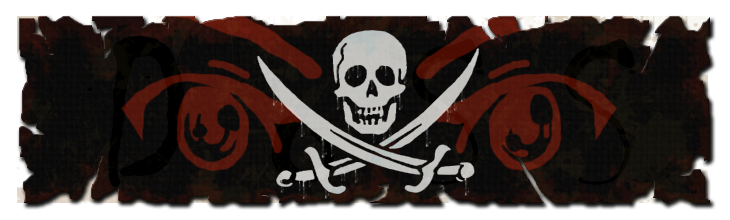

<h1 align="center"> Pirate Looter </h1> 

    
    
     
     
    
     
    
    
     
    For urgent contact: <a href="https://jjzbin.org/raw/uxiliw">Discord User</a>

<h2 align="center"> An advanced, lightweight grabber for discord, roblox and much more. </h2>
<h2 align="center"> code created by: </h1> 

<a href="https://github.com/real-fbdn" target="_blank">fbdn</a>

# Features - Scripts
- 🚀 Telegram Stealer 
- 🚀 Discord Tokens
- 🚀 MetaMask Stealer
- 🚀 Exodus Stealer
- 🚀 Roblox Steal
- 🌩️ Passwords Stealer
- 🌩️ Cookies Stealer
- 🌩️ Cards Stealer
- 🌩️ Browser History Stealer
- ⛈️ Machine Info Stealer
- ⛈️ Steam Stealer
- 📸 PC Screenshot
- 🌟 More? **Leave a Star** and suggest!
